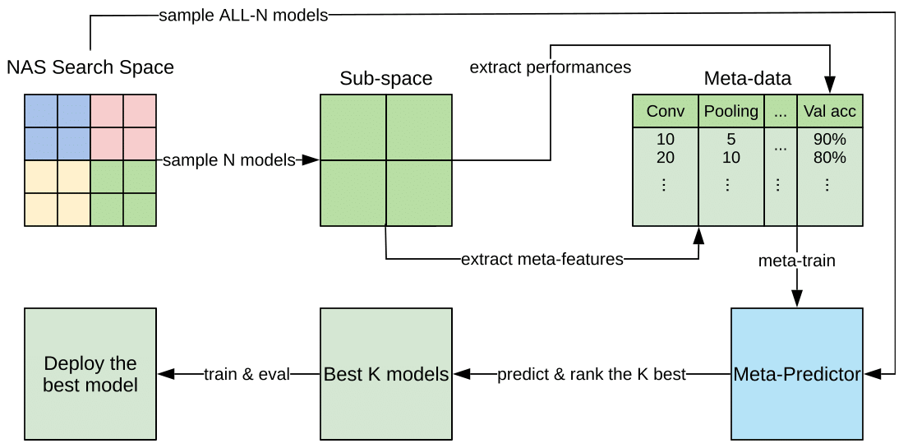

# NAS-Bench-101 and NAS-Bench-201 are Easier than You Think: Finding Good Architectures with Simple Meta-Predictors

This repository is the official implementation of MbML-NAS (Model-based Meta-Learning for NAS). 


<!-- [MbML-NAS](https://arxiv.org/abs/2030.12345)  -->

<div align="center">
  
  <p>Overview of the prediction-based NAS framework MbML-NAS.</p>
</div>

<!--  -->

<!-- ## Requirements

To install requirements:

```setup
pip install -r requirements.txt
```
 -->


## Data

The [Meta-NAS-Benchmarks](https://drive.google.com/drive/folders/1V5dFi3iMHG0CdZW8vwV7hgbd3Zz_OjBN) built from the original [NAS-Bench-101](https://github.com/google-research/nasbench) and [NAS-Bench-201](https://github.com/D-X-Y/NAS-Bench-201) benchmarks and used in our experiments can be downloaded here: https://drive.google.com/drive/folders/1V5dFi3iMHG0CdZW8vwV7hgbd3Zz_OjBN

There are different datasets and subsets which were built in order to make experiments more flexible and facilitate data exploration.

For [NAS-Bench-101](https://arxiv.org/abs/1902.09635):
> meta_nasbench101_4epochs: meta-info from 423k architectures trained by 4 epochs on CIFAR-10. \
meta_nasbench101_12epochs: meta-info from 423k architectures trained by 12 epochs on CIFAR-10. \
meta_nasbench101_36epochs: meta-info from 423k architectures trained by 36 epochs on CIFAR-10. \
meta_nasbench101_108epochs: meta-info from 423k architectures trained by 108 epochs on CIFAR-10. 

For [NAS-Bench-201](https://arxiv.org/abs/2001.00326):
> meta_nasbench201_cifar10valid: meta-info from 15k architectures trained by 1, 4, 12, 36, and 200 epochs on CIFAR-10. \
meta_nasbench201_cifar100: meta-info from 15k architectures trained by 1, 4, 12, 36, and 200 epochs on CIFAR-100. \
meta_nasbench201_imagenet16_120: meta-info from 15k architectures trained by 1, 4, 12, 36, and 200 epochs on ImageNet16-120. \
> **P.S:** There are subsets from each one of these datasets regarding a specific number of epochs. E.g: meta_nasbench201_cifar10valid_4epochs, meta_nasbench201_imagenet16_120_200epochs, etc.


## Training

To train the meta-predictors from the paper, run the notebooks ```nasbench_acc_prediction.ipynb ``` in notebooks/NAS-Bench-101 and ```nasbench201_acc_prediction.ipynb``` in notebooks/NAS-Bench-201.


## Evaluation

To see the final results generated from training on NAS-Bench-101 and NAS-Bench-201, see files ```nasbench_result_analysis.ipynb``` from notebooks/NAS-Bench-101, and ```nasbench201_result_analysis.ipynb``` from notebooks/NAS-Bench-201.


## Pre-trained Models

You can download the pre-trained meta-predictors here: https://drive.google.com/drive/folders/15RQJILgKgZ76PRgH1cFL7YUKSLELfK1- 

<!-- >📋  Give a link to where/how the pretrained models can be downloaded and how they were trained (if applicable).  Alternatively you can have an additional column in your results table with a link to the models. -->

<!-- ## Results

In summary, our models achieve the following performances:

### [Image Classification on ImageNet](https://paperswithcode.com/sota/image-classification-on-imagenet)

| Model name         | Top 1 Accuracy  | Top 5 Accuracy |
| ------------------ |---------------- | -------------- |
| My awesome model   |     85%         |      95%       |

>📋  Include a table of results from your paper, and link back to the leaderboard for clarity and context. If your main result is a figure, include that figure and link to the command or notebook to reproduce it. 


## Contributing

>📋  Pick a licence and describe how to contribute to your code repository.  -->